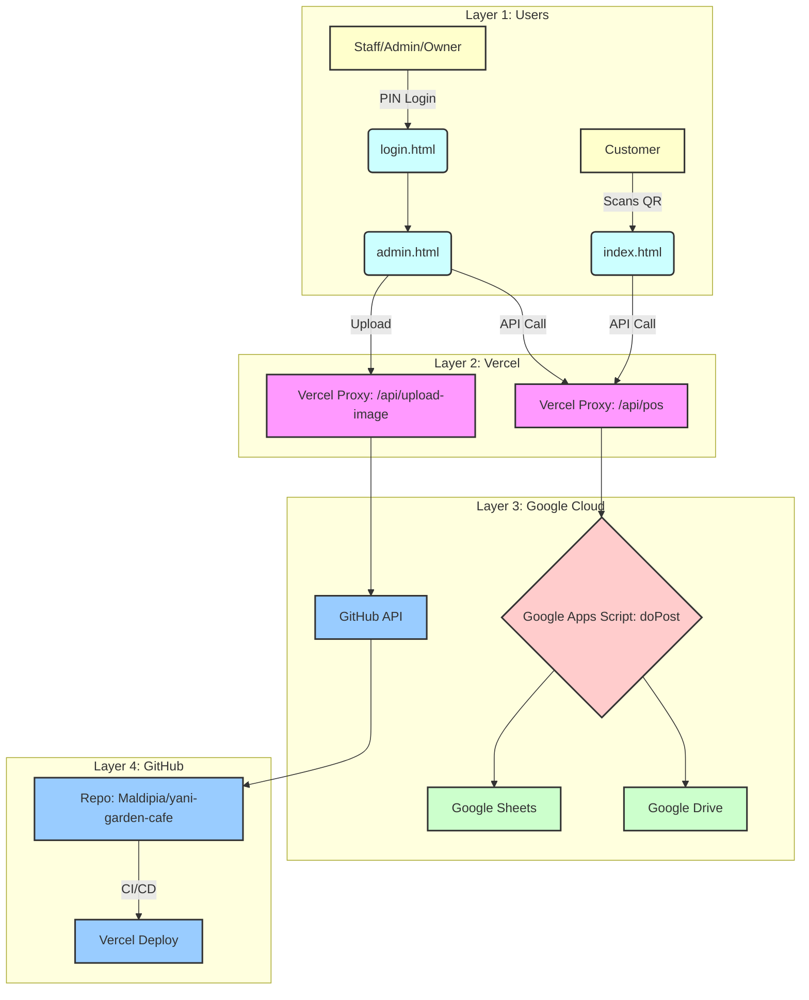

# Yani Garden Cafe POS — Engineering Blueprint & System Context

This document provides a comprehensive engineering blueprint for the Yani Garden Cafe POS system. It is intended to be used as a system context prompt for an AI assistant like Claude to enable it to understand, debug, and extend the system.

## 1. Core Architecture

The system is a **serverless, 4-layer architecture** designed for low cost, high availability, and easy maintenance. It avoids traditional servers and databases in favor of a modern Jamstack + Google Cloud approach.

| Layer | Technology | Role & Key Details |
|---|---|---|
| **1. Frontend** | Vercel (Static CDN) | Hosts the static HTML/CSS/JS files (`index.html`, `admin.html`, `login.html`). All assets are served from Vercel's global CDN for fast loading. No frontend frameworks are used (vanilla JS). |
| **2. API Proxy** | Vercel (Serverless Functions) | Two Node.js functions (`/api/pos`, `/api/upload-image`) act as a secure proxy layer. This is critical because it shields the backend Google Apps Script URL from the public and handles Google's quirky 302 redirect behavior. |
| **3. Backend** | Google Apps Script (GAS) | A single `Code.gs` file contains all business logic, acting as a monolithic backend API. It exposes ~18 actions (e.g., `placeOrder`, `getOrders`, `editOrderItems`) via a single `doPost` endpoint. |
| **4. Database** | Google Sheets & Google Drive | A single Google Sheet (`SPREADSHEET_ID: 14wSvfCy5LUrlgi4d48jcGjnFpy310XYUsCWCg5VMg0g`) acts as the database, with 8 tabs serving as tables (YGC_MENU, ORDERS, USERS, etc.). Google Drive is used for file storage (payment proofs, receipts). |
| **5. Source Control & CI/CD** | GitHub | The `Maldipia/yani-garden-cafe` repository is the single source of truth for all code and image assets. Every `git push` to the `main` branch automatically triggers a Vercel deployment. |

### Architectural Diagram



## 2. Key Logic & Implementation Details

### 2.1. Vercel API Proxy (`/api/pos.js`)

This is the **most critical architectural component**. It solves the Google Apps Script 302 redirect problem.

- **Problem**: When you `POST` to a GAS web app, it doesn't return the JSON directly. It returns a `302 Found` redirect, and the *actual* JSON response is at the `Location` header URL, which you must then `GET`.
- **Solution**: The `/api/pos.js` Vercel function acts as a server-side proxy. It receives the `POST` from the frontend, makes the `POST` to GAS with `redirect: 'manual'`, catches the 302, follows the `location` URL with a `GET`, retrieves the final JSON, and returns it to the frontend with a clean `200 OK`.
- **Code Snippet**:
  ```javascript
  // In /api/pos.js
  const postResponse = await fetch(APPS_SCRIPT_URL, { ... redirect: 'manual' });
  if (postResponse.status === 302) {
    const redirectUrl = postResponse.headers.get('location');
    const getResponse = await fetch(redirectUrl);
    responseText = await getResponse.text();
  }
  return res.status(200).json(JSON.parse(responseText));
  ```

### 2.2. Photo Uploads (`/api/upload-image.js`)

This flow decouples image hosting from Google Drive, ensuring fast load times via Vercel's CDN.

1.  **Frontend**: The admin dashboard (`admin.html`) reads the selected image file, converts it to a `base64` string, and `POST`s it to `/api/upload-image` along with the item `code` and file `ext`.
2.  **Vercel Function**: The function receives the base64 data.
3.  **GitHub API Commit**: It uses a `GITHUB_TOKEN` (stored as a Vercel environment variable) to call the GitHub Contents API (`PUT /repos/{owner}/{repo}/contents/{path}`). This commits the image directly to the `images/` directory in the GitHub repository.
4.  **CI/CD Trigger**: This commit automatically triggers a new Vercel deployment.
5.  **Alias Promotion**: After a 90-second delay (to allow Vercel to build), the function makes a fire-and-forget call to the Vercel API to promote the newly built deployment to the production alias. This ensures the new image is live on the main URL immediately.

### 2.3. Google Apps Script Backend (`Code.gs`)

This is a monolithic API with a JSON-RPC style action dispatcher.

- **`doPost(e)`**: The main entry point. It parses the incoming JSON `e.postData.contents`, reads the `action` field, and routes to the corresponding function (e.g., `action: 'placeOrder'` calls `placeOrder(data)`).
- **Header-Based DB Operations**: To prevent errors when columns are moved in Google Sheets, all read/write operations use helper functions (`appendByHeaders`, `updateByHeaders`). These functions map data objects to the correct columns by matching object keys to the header names in row 1 of the sheet.
- **Authentication**: Admin/staff access is controlled by `verifyUserPin(pin)`. It hashes the incoming PIN with SHA-256 and compares it to the `PIN_HASH` stored in the `USERS` sheet. It also includes logic for account lockout after 3 failed attempts.
- **Order Placement Logic (`placeOrder`)**:
    1.  **Token Validation**: Calls `validateTableToken(tableNo, token)` to check if the QR code token is valid by looking it up in the `TABLES` sheet.
    2.  **Throttling**: Calls `isThrottled(tableNo)` to prevent duplicate orders from the same table within a 30-second window.
    3.  **Order Number**: Calls `getNextOrderNumber()` to atomically increment the `NEXT_ORDER_NO` in the `SETTINGS` sheet.
    4.  **Totals Calculation**: Calculates `subtotal`, adds a 10% `serviceCharge` for DINE-IN orders, and computes the final `total`.
    5.  **Write to Sheets**: Appends one row to the `ORDERS` sheet and multiple rows (one per item) to the `ORDER_ITEMS` sheet.
    6.  **Logging**: Calls `logAction()` to write a record to the `LOGS` sheet.
- **Order Editing Logic (`editOrderItems`)**:
    1.  Finds the order in the `ORDERS` sheet by `orderId`.
    2.  Recalculates `subtotal`, `serviceCharge`, and `total` based on the `newItems` array provided.
    3.  **Deletes all existing rows** for that `orderId` from the `ORDER_ITEMS` sheet.
    4.  **Appends new rows** to the `ORDER_ITEMS` sheet based on the `newItems` array.
    5.  Updates the totals and `ITEMS_JSON` in the main `ORDERS` sheet row.

## 3. Data Structures

### Google Sheets Schema

| Sheet | Key Columns | Purpose |
|---|---|---|
| **YGC_MENU** | `item_id`, `item_name`, `price`, `priceShort`, `priceMedium`, `priceTall`, `category`, `grabfood_status` | Master menu data. `grabfood_status: 'ACTIVE'` means the item is available. |
| **ORDERS** | `ORDER_ID`, `ORDER_NO`, `TABLE_NO`, `STATUS`, `SUBTOTAL`, `SERVICE_CHARGE`, `TOTAL`, `ITEMS_JSON` | Main order table. `ITEMS_JSON` is a snapshot of the cart at the time of order. |
| **ORDER_ITEMS** | `ORDER_ID`, `ITEM_CODE`, `ITEM_NAME_SNAPSHOT`, `QTY`, `UNIT_PRICE_SNAPSHOT`, `LINE_TOTAL` | Detailed line items for every order. Prices are snapshots to protect against future menu price changes. |
| **USERS** | `USER_ID`, `USERNAME`, `ROLE`, `PIN_HASH`, `ACTIVE`, `FAILED_ATTEMPTS`, `LOCKED_UNTIL` | Staff/Admin/Owner accounts and credentials. |
| **TABLES** | `TABLE_NO`, `TOKEN` | Maps physical table numbers to their unique QR code tokens for validation. |
| **LOGS** | `TIMESTAMP`, `ACTION`, `ACTOR`, `TARGET_ID`, `DETAILS`, `STATUS` | Immutable audit trail for all significant system events. |
| **SETTINGS** | `KEY`, `VALUE` | Key-value store for global configuration like `NEXT_ORDER_NO`, `ADMIN_PIN`, `SERVICE_CHARGE_RATE`. |
| **PAYMENTS** | `PAYMENT_ID`, `ORDER_ID`, `AMOUNT`, `PROOF_FILE_ID`, `STATUS` | Tracks customer payment submissions. |

### Frontend State (`admin.html`)

- **`allOrders = []`**: A global array holding all fetched orders. This is the main in-memory state for the dashboard.
- **`window._menuDataCache = []`**: A cache of the full menu (from `getMenuAdmin`) used by the Edit Order modal to populate the "Add Items" section.
- **`eoItems = []`**: A temporary array holding the items currently being edited in the Edit Order modal.

## 4. How to Debug & Extend

- **Problem: "Unknown action: X"**
  - **Cause**: You added a new function `X` to `Code.gs` but forgot to add `if (action === 'X') { ... }` to the `doPost` dispatcher, OR you forgot to redeploy the Google Apps Script.
  - **Fix**: Add the action to `doPost` and then go to the GAS editor → Deploy → Manage Deployments → Edit → New Version → Deploy.
- **Problem: Menu prices are wrong on the customer page.**
  - **Cause**: The `getMenu` API call is failing, so the frontend is using the stale `MENU_DATA_FALLBACK` array.
  - **Fix**: Check the Vercel function logs for `/api/pos` to see why the call to GAS is failing. Check the GAS execution logs.
- **Problem: Uploaded photo doesn't appear.**
  - **Cause**: The `GITHUB_TOKEN` or `VERCEL_TOKEN` environment variables are missing/invalid in Vercel, OR the alias promotion failed.
  - **Fix**: Check the Vercel function logs for `/api/upload-image`. Verify the tokens are set correctly. Manually check the latest deployments on Vercel and assign the production alias if needed.
- **To Add a New API Action `myNewAction`**:
  1.  Write `function myNewAction(data) { ... }` in `Code.gs`.
  2.  Add `if (action === 'myNewAction') { return jsonResponse(myNewAction(data)); }` to the `doPost` function in `Code.gs`.
  3.  Call it from the frontend using `await api('myNewAction', { ... });`.
  4.  **Deploy the Google Apps Script.**
